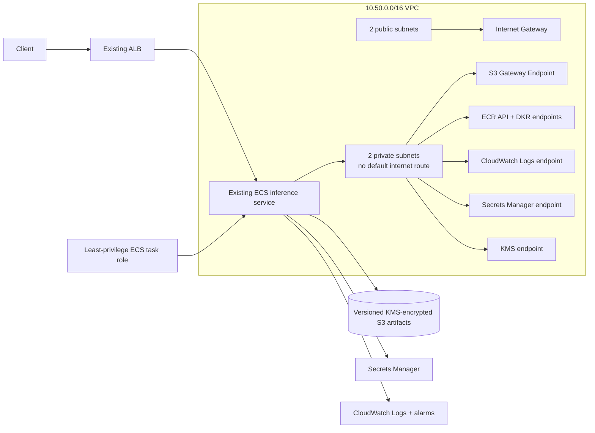

# AWS ML Platform

A credential-free, Terraform-validated reference for the infrastructure boundary around a production ML inference service on AWS.

> Portfolio reference implementation only. The Terraform models networking, artifact security, runtime IAM, autoscaling and operational signals; it deliberately accepts an existing ECS cluster/service and ALB dimension instead of pretending this small repository provisions an entire production organization.

## Implemented architecture



## What is implemented

### Private networking

`infra/networking.tf` creates:

- one VPC with DNS support/hostnames;
- two public and two private subnets across available AZs;
- an Internet Gateway and public route table;
- a private route table with **no default internet route**;
- an S3 Gateway VPC endpoint;
- Interface VPC endpoints for ECR API, ECR Docker, CloudWatch Logs, Secrets Manager and KMS;
- a dedicated endpoint security group permitting HTTPS from the VPC CIDR.

The private subnet design is intentionally endpoint-driven. A workload that needs arbitrary outbound Internet access would require an explicit egress design such as NAT; this repository does not silently add one.

### Artifact security and runtime IAM

`infra/security.tf` creates:

- an S3 artifact bucket with all public-access paths blocked;
- BucketOwnerEnforced object ownership;
- S3 object versioning;
- a rotating KMS key and alias;
- KMS-backed server-side encryption with S3 bucket keys;
- a Secrets Manager secret encrypted with the same platform key;
- an ECS task role with scoped access to model objects, bucket listing, the database secret and KMS decrypt.

The task role is intentionally separate from deployment/CI identity.

### Autoscaling and operational signals

`infra/autoscaling.tf` models:

- ECS Application Auto Scaling for an externally supplied cluster/service;
- CPU target tracking at 60%;
- memory target tracking at 70%;
- a 30-day CloudWatch log group;
- ALB target 5xx alarms;
- ALB target response-time alarms.

The ECS service and ALB are inputs because this repository focuses on reusable platform concerns rather than embedding a large monolithic stack.

## Credential-free CI

Every push and pull request runs:

```text
terraform fmt -check -diff
terraform init -backend=false -input=false
terraform validate
```

This verifies formatting, provider installation and Terraform/provider-schema coherence without placing AWS credentials in pull-request CI. It does **not** claim that a credential-free validation proves a live AWS deployment will succeed.

## Files

```text
infra/
├── versions.tf      # Terraform/AWS provider configuration
├── variables.tf     # explicit external integration inputs
├── networking.tf    # VPC, subnets, routing and VPC endpoints
├── security.tf      # S3, KMS, Secrets Manager and IAM
└── autoscaling.tf   # ECS scaling, logs and ALB alarms
```

## Broader AWS service map

The wider portfolio uses this validated infrastructure layer as the AWS analogue for an ML platform involving S3, ECR, ECS/EKS, SageMaker, RDS/DynamoDB, ElastiCache, Glue/Athena, SQS/SNS/EventBridge/Kinesis and CloudWatch. Those services are architectural mappings unless code exists in this repository; the bullets above are the concrete Terraform implemented here.

The repository contains no employer data, credentials or proprietary infrastructure.
