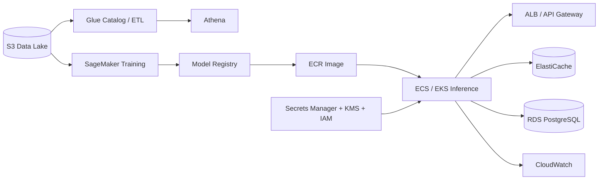

# AWS ML Platform

Reference architecture for taking an ML workload from training data to production inference on AWS.

## Coverage

- S3 data lake patterns
- Glue/Athena analytics
- SageMaker-style training and model registry concepts
- ECR container registry
- ECS/EKS deployment patterns
- API Gateway / ALB serving
- RDS, DynamoDB and ElastiCache design choices
- IAM least privilege
- KMS encryption and Secrets Manager
- CloudWatch observability
- Terraform infrastructure as code

The repository uses synthetic/public examples only.
